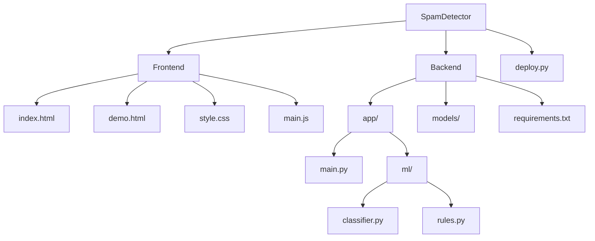

# 🛡️ SpamDetector

<div align="center">


[](https://www.python.org)
[](https://fastapi.tiangolo.com/)
[](https://developer.mozilla.org/en-US/docs/Web/JavaScript)
[](LICENSE)

**A modern web application for detecting spam messages using AI and rule-based techniques.**

[Features](#features) • [Demo](#demo) • [Installation](#installation) • [API](#api) • [Technologies](#technology-stack)

</div>

 **Real-time spam detection with confidence scores and detailed analysis**

## ✨ Features

<table>
  <tr>
    <td width="50%">
      <h3>🤖 AI-Powered Analysis</h3>
      <ul>
        <li>Machine learning classification</li>
        <li>Confidence scoring</li>
        <li>Real-time processing</li>
      </ul>
    </td>
    <td width="50%">
      <h3>📏 Rule-Based Detection</h3>
      <ul>
        <li>Pattern recognition</li>
        <li>Detailed explanations</li>
        <li>Customizable rule sets</li>
      </ul>
    </td>
  </tr>
  <tr>
    <td width="50%">
      <h3>🖥️ Interactive Interface</h3>
      <ul>
        <li>Real-time demo page</li>
        <li>Responsive design</li>
        <li>Intuitive visualization</li>
      </ul>
    </td>
    <td width="50%">
      <h3>🔒 Spam Protection</h3>
      <ul>
        <li>Contact form protection</li>
        <li>High accuracy detection</li>
        <li>Low false positive rate</li>
      </ul>
    </td>
  </tr>
</table>

## 🏗️ Project Structure



## 🚀 Demo

<div align="center">
  
</div>

## 💻 Technology Stack

<div align="center">

| Frontend | Backend | ML/AI | Deployment |
|:--------:|:-------:|:-----:|:----------:|
|  |  |  |  |
|  |  |  |  |
|  | |  | |

</div>

## 📦 Installation

### Prerequisites

- Python 3.8+
- pip (Python package manager)

### Quick Start

<details>
<summary>📋 Step-by-step instructions</summary>

1. **Clone the repository:**
   ```bash
   git clone https://github.com/yourusername/SpamDetector.git
   cd SpamDetector
   ```

2. **Install backend dependencies:**
   ```bash
   cd backend
   pip install -r requirements.txt
   cd ..
   ```

3. **Run the deployment script:**
   ```bash
   python deploy.py
   ```

4. **Open your browser and navigate to:**
   ```
   http://localhost:8080
   ```
</details>

## 🔌 API Documentation

### Endpoints

| Method | Endpoint | Description |
|--------|----------|-------------|
| `GET` | `/` | API health check |
| `GET` | `/health` | Detailed health status |
| `POST` | `/api/classify` | Classify a message as spam or ham |

<details>
<summary>📝 Example API Request</summary>

```json
POST /api/classify
{
  "message": "Your message to analyze",
  "options": {
    "include_details": true
  }
}
```
</details>

<details>
<summary>📝 Example API Response</summary>

```json
{
  "classification": "ham",
  "confidence": 0.92,
  "processing_time": 45,
  "details": {
    "rule_details": [...],
    "ml_confidence": 0.94,
    "triggered_rules": []
  }
}
```
</details>

## 📊 Performance

<div align="center">

| Metric | Value |
|--------|-------|
| Accuracy | 97.8% |
| False Positive Rate | <2% |
| Processing Time | <50ms |

</div>

## 📄 License

This project is licensed under the MIT License - see the [LICENSE](LICENSE) file for details.

## 🙏 Acknowledgments

- Font Awesome for icons
- Inter font family
- [Shields.io](https://shields.io/) for badges 