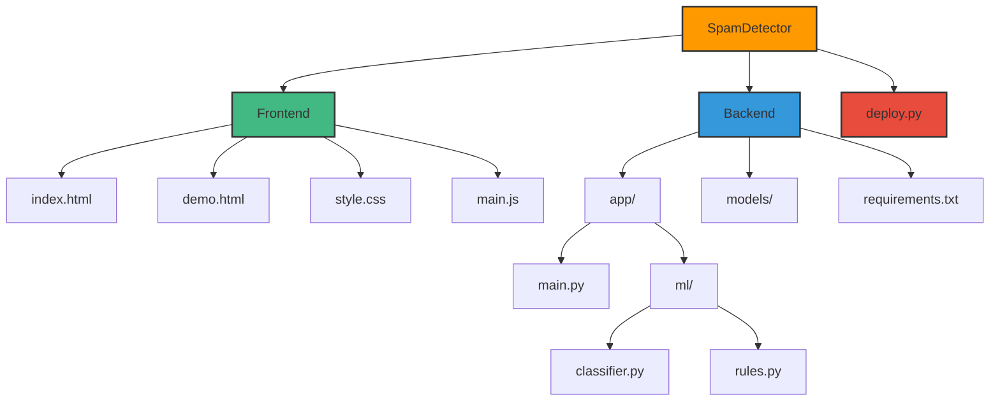
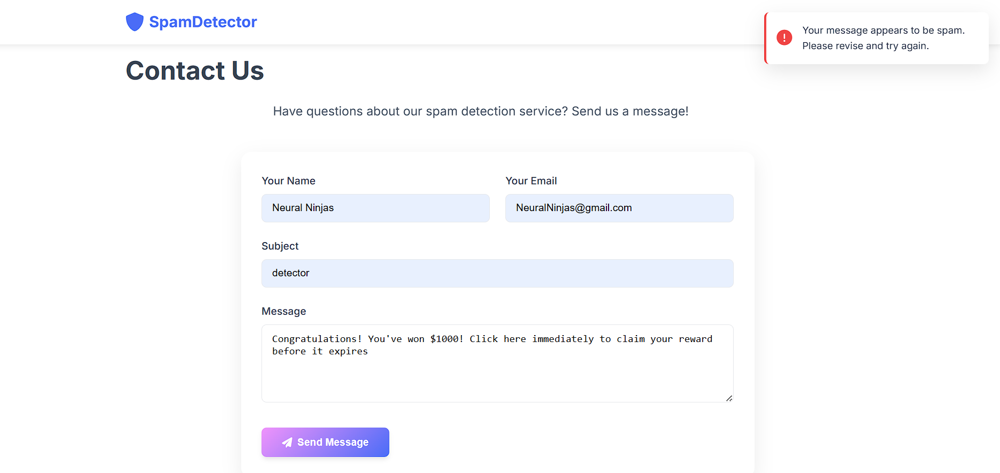

# 🛡️ SpamDetector

<div align="center">


[](https://www.python.org)
[](https://fastapi.tiangolo.com/)
[](https://developer.mozilla.org/en-US/docs/Web/JavaScript)
[](LICENSE)

**A modern web application for detecting spam messages using AI and rule-based techniques.**

[✨ Features](#-features) • [🚀 Demo](#-demo) • [📦 Installation](#-installation) • [💻 Technologies](#-technology-stack)

<a href="#-installation">
  
</a>

</div>

<p align="center">
  
</p>

 **Real-time spam detection with confidence scores and detailed analysis**

## ✨ Features

<div align="center">
  
</div>

<table>
  <tr>
    <td width="50%">
      <h3 align="center">🤖 AI-Powered Analysis</h3>
      <p align="center">
        
      </p>
      <ul>
        <li>Machine learning classification</li>
        <li>Confidence scoring</li>
        <li>Real-time processing</li>
      </ul>
    </td>
    <td width="50%">
      <h3 align="center">📏 Rule-Based Detection</h3>
      <p align="center">
        
      </p>
      <ul>
        <li>Pattern recognition</li>
        <li>Detailed explanations</li>
        <li>Customizable rule sets</li>
      </ul>
    </td>
  </tr>
  <tr>
    <td width="50%">
      <h3 align="center">🖥️ Interactive Interface</h3>
      <p align="center">
        
      </p>
      <ul>
        <li>Real-time demo page</li>
        <li>Responsive design</li>
        <li>Intuitive visualization</li>
      </ul>
    </td>
    <td width="50%">
      <h3 align="center">🔒 Spam Protection</h3>
      <p align="center">
        
      </p>
      <ul>
        <li>Contact form protection</li>
        <li>High accuracy detection</li>
        <li>Low false positive rate</li>
      </ul>
    </td>
  </tr>
</table>

<p align="center">
  
</p>

## 🏗️ Project Structure

<div align="center">
  
  
  
  
  
</div>



<p align="center">
  
</p>

## 🚀 Demo

<div align="center">
  
</div>

<p align="center">
  
</p>

## 💻 Technology Stack

<div align="center">

| Frontend | Backend | ML/AI | Deployment |
|:--------:|:-------:|:-----:|:----------:|
|  |  |  |  |
|  |  |  |  |
|  | |  | |

</div>

<p align="center">
  
</p>

## 📦 Installation

### Prerequisites

<div align="center">
  
</div>

- Python 3.8+
- pip (Python package manager)

### Quick Start

<details open>
<summary>📋 Step-by-step instructions</summary>

1. **Clone the repository:**
   ```bash
   git clone https://github.com/yourusername/SpamDetector.git
   cd SpamDetector
   ```

2. **Install backend dependencies:**
   ```bash
   cd backend
   pip install -r requirements.txt
   cd ..
   ```

3. **Run the deployment script:**
   ```bash
   python deploy.py
   ```

4. **Open your browser and navigate to:**
   ```
   http://localhost:8080
   ```
</details>

<p align="center">
  
</p>


<div align="center">
  <a href="#">
    
  </a>
</div> 

